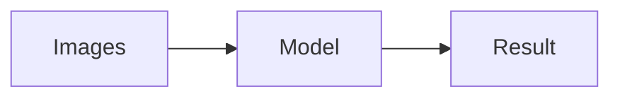
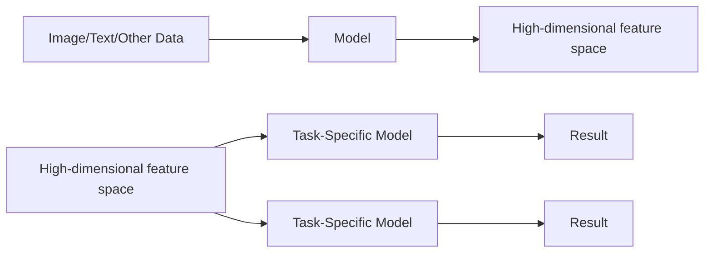


TODO


## Background on Helmholtz Imaging

- **Helmholtz** is Germany's largest research organization
- **Helmholtz Imaging** is a platform initiated by the Helmholtz Information & Data Science Incubator
- **The mission of Helmholtz Imaging** is to unlock the potential of imaging in the Helmholtz Association across 
  all research domains and along the entire imaging pipeline


img/logos/desy.png
img/logos/dkfz.png
img/logos/mdc.png


- https://helmholtz-imaging.de




---


{{
}}
# Advances in scientific image processing through AI
{{
}}



In this first part, I will go through examples of advances and AI based tools in scientific image processing. Of 
course, I can only scratch the surface here.


---

## AI in Image Enhancement
### CARE - Content Aware Image Restoration


TODO make it proper:
- Let’s talk about another method for enhancing image quality using content aware image restoration
- What is done here is that a classical UNet is trained on both low quality and high quality data, that means for one 
  experiment you only need to acquire higher quality data, i.e. using longer exposure, for a good subset of representative data, and then the rest of the data can be acquired with lower quality settings (faster, or less desctructive) and fixed through the trained model.
- This  can be used to restore images from low photon exposure settings or for isotropic reconstruction of 
  undersampled images


{{
}}



{{
}}


- [Weigert, M., Schmidt, U., Boothe, T. et al. Content-aware image restoration: pushing the limits of fluorescence 
  microscopy. Nat Methods 15, 1090–1097 (2018).](https://doi.org/10.1038/s41592-018-0216-7)



---

## AI in Denoising
### Noise2Void



TODO make it proper:
- What if we don’t have such training pairs for enhancing the quality of our images? 
- The next method I’m highlighting is noise2void, where all you need is noisy image datasets where the noise is 
  independent of the pixel location.
- Since no denoised training images exist, the method uses the noisy image both as input and target for the model, 
  but the model has a blind spot, it can’t see the value of the input pixel it’s trying to predict, therefore learning to predict it based on the context of the neighboring pixels.
- This method was also implemented as a fiji plugin back then and now is available as a napari plugin, making it 
  easier for non computer scientists to apply it








- [Krull, A., Buchholz, T.-O., & Jug, F. (2019). Noise2void-learning denoising from single noisy images. Proceedings of the IEEE Conference on Computer Vision and Pattern Recognition, 2129–2137.](https://ieeexplore.ieee.org/document/8954066)




---

## AI in Segmentation
### nnU-Net




TODO make it proper:
- Moving along, segmentation is a highly requested task in image processing 
- For deep learning - based segmentation, UNETs are usually trained on annotated training datasets, but the 
  configuration of the training is not trivial for scientists without a computer science degree
- This tool called nnU-Net only needs to an annotated training dataset and will derive the fingerprint of the problem,
  meaning all parameters based on the data for configuring the most suitable UNET.
- at the end of its automated pipeline it will return fully configured and trained U-Net models that can be used to 
  run predictions on new images
- This approach has won several competitions just out-of-the-box by applying the method to the competition training 
  dataset
- It was developed by my helmholtz imaging colleagues at the german cancer research center








- [Isensee, F., Jaeger, P. F., Kohl, S. A., Petersen, J., & Maier-Hein, K. H. (2021). nnU-Net: a self-configuring method for deep learning-based biomedical image segmentation. Nature methods, 18(2), 203-211.](https://www.nature.com/articles/s41592-020-01008-z)




---

## AI in Segmentation
### CellPose



TODO make it proper:
- The previous example was optimized for performing well on data from any kind of domain, other tools focus are designed on a specific domain such as this one here:
- cellular segmentation is a highly common task in bioimaging and CellPose has brought the community a huge step 
  forward by providing a user friendly interface and pretrained models for a variety of existing cell types
- It includes a routine for human in the loop training to finetune existing models using your own data
- This was just extended to also include denoising, deblurring and upsampling






- **Improved accuracy**: Enhanced cell segmentation quality, boosting reliability in biological research.
- **Broad adoption**: Widely used across fields, accelerating discoveries in cell biology.
- **Cross-disciplinary impact**: Applied in diverse areas, from neuroscience to cancer research.




- [Stringer, C., Wang, T., Michaelos, M. et al. Cellpose: a generalist algorithm for cellular segmentation. Nat Methods 18, 100–106 (2021). https://doi.org/10.1038/s41592-020-01018-x](https://www.nature.com/articles/s41592-020-01018-x)


Here’s a version tailored for **StarDist**, an AI-based tool specifically designed for **segmentation of star-convex objects** such as cells and nuclei:

---

## AI in Segmentation
### StarDist - Cell detection with star-convex shapes


- The previous example highlighted a generalist tool for segmentation, but **StarDist** is optimized for specific tasks like segmenting cells and nuclei in microscopy images.
- It uses a unique approach that represents objects as star-convex polygons, allowing for more precise segmentation, especially in densely packed or irregularly shaped cell structures.
- StarDist has gained popularity due to its ability to handle overlapping objects and produce accurate segmentations, even for complex shapes.
- Like CellPose, it offers a user-friendly interface and pretrained models, along with options to finetune models with your own data.




- Accurately segments irregular, star-convex objects like cells and nuclei.
- Excels in separating densely packed cells, a common challenge in microscopy images.


- [Schmidt, U., Weigert, M., Broaddus, C. et al. Cell detection with star-convex polygons. Medical Image Computing and Computer Assisted Intervention – MICCAI 2018.](https://doi.org/10.1007/978-3-030-00934-2_30)



---




- [© Müller et al. https://doi.org/10.1083/jcb.202010039](https://rupress.org/jcb/article/220/2/e202010039/211599/3D-FIB-SEM-reconstruction-of-microtubule-organelle) 





TODO




---

## AI in Image Interpretability
### CytoSelf



TOOD
In High Throughput imaging, we deal with a vast number of images which we can explore effectively and intelligently 
using AI methods. 





- **Protein localization**: Enhanced understanding of protein patterns in cells through unsupervised learning.
- **High-throughput phenotyping**: Enabled large-scale, detailed analysis of protein organization across diverse cell types.
- **Unbiased discovery**: Identified novel subcellular structures without prior annotations.




- [Kobayashi, H., Cheveralls, K.C., Leonetti, M.D. et al. Self-supervised deep learning encodes high-resolution 
  features of protein subcellular localization. Nat Methods 19, 995–1003 (2022).](https://doi.org/10.1038/s41592-022-01541-z)



---

## AI in Synthetic Data Generation
### GLAM - Generative Lung Architecture Modeling


TODO make it proper:
dded into workflows spanning across the whole imaging pipeline
This is a research project from my group together with researchers from helmholtz munich and university of stuttgart
XXX


{{
}}









{{
}}


- [J. C. Pestoni, E. Bahry, K. Hirzel, T. Savchyn, L. Epstein, V. Getmanchuk, M. Gregor, T. Conlon, A. Yildirim, K. 
  Harrington, D. Kainmüller, M. Heymann, D. Schmidt, and G. Burgstaller . Generative Lung Architecture Modeling - 
  Helmholtz AI project]()



---


{{
}}
# Challenges of AI applications
# in scientific image processing
{{
}}


---

## Challenges in AI-Based Methods

- **Reproducibility & Usability**:
  - Difficult to reproduce, often lack user-friendly tools.
  - Optimized for 2D natural images, less effective for scientific datasets.

- **Dataset & Bias Issues**:
  - Models depend on training data, limiting generalization.
  - Undetected bias and challenging result validation.

- **Resource Constraints**:
  - High computational demands, raising concerns about availability.

- **Emerging Risks**:
  - Deep fakes threaten the integrity of scientific imaging.



---

## Need of high quality annotations


TODO



### Why labeling instructions matter

TODO


- [Rädsch, T., Reinke, A., Weru, V. et al. Labelling instructions matter in biomedical image analysis. Nat Mach 
  Intell 5, 273–283 (2023).](https://doi.org/10.1038/s42256-023-00625-5)






### Ilastik

TODO


- [https://ilastik.org](https://ilastik.org)





### Labkit

TODO


- [https://imagej.net/plugins/labkit](https://imagej.net/plugins/labkit)








---

## What’s next?





> We are currently living in a transformative period in which the century-old promises of AI are rapidly becoming reality.


- [From: Royer, L.A. The future of bioimage analysis: a dialog between mind and machine. Nat Methods 20, 951–952 
  (2023).](https://doi.org/10.1038/s41592-023-01930-y)





> The problem is that neither individuals nor governments seem to be able to follow the pace of these technological developments.


- [From: Vinuesa, R., Azizpour, H., Leite, I. et al. The role of artificial intelligence in achieving the 
  Sustainable Development Goals. Nat Commun 11, 233 (2020).](https://doi.org/10.1038/s41467-019-14108-y)






---

## What’s next?
### Multimodal image processing


 > A complete picture of how life functions can only be attained if we leverage all these technologies together. In essence, we reimagine the future of optical microscopy wherein we can image anything anywhere at any time.


- [From: Balasubramanian, H., Hobson, C.M., Chew, TL. et al. Imagining the future of optical microscopy: everything, 
  everywhere, all at once. Commun Biol 6, 1096 (2023).](https://doi.org/10.1038/s42003-023-05468-9)


---

## What’s next?






 > A complete picture of how life functions can only be attained if we leverage all these technologies together. In 
 > essence, **we reimagine the future of optical microscopy wherein we can image anything anywhere at any time.**



- [From: Balasubramanian, H., Hobson, C.M., Chew, TL. et al. Imagining the future of optical microscopy: everything, 
  everywhere, all at once. Commun Biol 6, 1096 (2023).](https://doi.org/10.1038/s42003-023-05468-9)








- [From: Acosta, J.N., Falcone, G.J., Rajpurkar, P. et al. Multimodal biomedical AI. Nat Med 28, 1773–1784 (2022).](https://doi.org/10.1038/s41591-022-01981-2)




 


---

## What’s next?


Foundation models work by learning general-purpose features from massive datasets. These features are then used by task-specific models, which are trained separately on top of the pretrained foundation model. This enables the model to generalize across many tasks with minimal additional training.


### "Common" AI models like U-Net

### Foundation models



- **Pretrained model**: Extracts general-purpose features from the input data (e.g., images or text). This feature extraction process is *fixed* after pretraining.
- **Feature extraction**: The output from the pretrained model is a rich, high-dimensional feature representation that can be used for various tasks.
- **Task-specific models**: Smaller models are trained separately on top of the extracted features to map them to specific outputs, such as classification, translation, or other tasks.

- **Transformers**: The foundation models use the transformer architecture to capture complex relationships within the input data, allowing for powerful, generalizable feature extraction.



---

## Foundation Models

### High Dimensional Feature Space / Latent Space / Embedding Space



- **Imagine describing food using multiple characteristics:**

- **1D Space**: If you only consider **taste**, foods like **cake** (sweet) and **chips** (salty) can be placed on a line.

- **2D Space**: Add **texture** to the mix. Now, **cake** is sweet and soft, while **chips** are salty and crunchy.

- **3D Space**: Include **temperature**—**ice cream** (cold and sweet) and **soup** (hot and savory) would now be placed differently.



- Example: **Food**
  - 1D Space: **taste**
  - 2D Space: taste + **texture**
  - 3D Space: taste + texture + **temperature**
  - High dimensional space: One direction could represent **Impact on severity of PMS symptoms**


A foundation model automatically learns to extract and represent important features from vast amounts of data, without needing explicit instructions on what those features should be, allowing it to generalize across many tasks.


### Helmholtz Foundation Model Initiative

- [https://www.helmholtz.de/system/user_upload/Forschung/KI/Factsheet_FM_EN_web_final.pdf](https://www.helmholtz.de/system/user_upload/Forschung/KI/Factsheet_FM_EN_web_final.pdf)

---



## Thank you!


**support@helmholtz-imaging.de**

**https://connect.helmholtz-imaging.de**

**deborah.schmidt@mdc-berlin.de**








