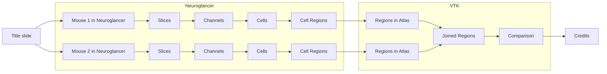

## The message


Let's start with the most important question. What is the message of the video? What are you trying to convey 
visually? What are we seeing and what is the impact?

Being able to formulate a clear statement will help us to determine the visual focus of the video.


- **Task**: Once sentence - what is the video about?

---

## The message

### Example

We compare a gene mutated mouse brain to a wildtype and discover significantly less activated cells in a specific 
region of the hypothalamus.  

---

## Sequence sketch


Sketching the story of the video as a sequence is useful for separating the full sequence into individual modules 
which maybe are created using different tools.


- Break down video components
- Choose a diagram type
  - Flowchart: For an overall high-level view of the video structure.
  - Gantt Chart: If you're managing timelines, e.g., durations of different segments.
  - Sequence Diagram: To describe interactions between different tools, data, and rendering stages.
  - Graph/State Diagram: To visualize the transition between different tools or stages in the rendering pipeline.

TODO diagram type images

---

## Sequence sketch

### Example

---

## List video modules

- **Task**: Create comprehensive list of videos and images to be rendered

---

## List video modules
### Example

#### Neuroglancer (all items have to be done for both mice)
- [-] 3D rotation of all channels
- [ ] 3D Zoom in
- [-] Slice from front to center of all channels
- [ ] Slice from front to center of cells on cFOS

### VTK
- [ ] Still image from regions and cells on center slice of both mice next to each other (same view as Neuroglancer)
- [ ] Morphing from regions and cells to atlas in 2D
- [ ] Slice out to show 3D
- [ ] 3D Rotation
- [ ] Blend to Hypothalamus (rotating)
- [ ] Overlay animation of both regions (rotating)
- [ ] Comparison coloring of regions (rotating)

---

## Consistency across tools


When using different tools for different parts of the video, the style differences between the tools can challenge 
viewers to understand what's happening and where their focus should be. It is therefore helpful to stay consistent 
across tools as much es possible. Here are some aspects which can be synchronized:


- Use of colors / colormaps
- Viewport
- Labels
- TODO more?

---

## Video cut

Once all individual components of the videos are rendered, we can assemble them into one final product. 
TODO explain why we use Kdenlive for this tutorial


- Kdenlive
- TODO list alternatives

---

## Video cut
### Blending in between clips

TODO explanation of what to do


TODO short bullet points listing the steps

---

## Video cut
### Showing two clips next to each other

TODO explanation of what to do


TODO short bullet points listing the steps

---

## Video cut
### Simultaneous sliced view of multiple clips

TODO explanation of what to do


TODO short bullet points listing the steps

---

## Video cut
### Text annotations

TODO explanation of what to do


TODO short bullet points listing the steps