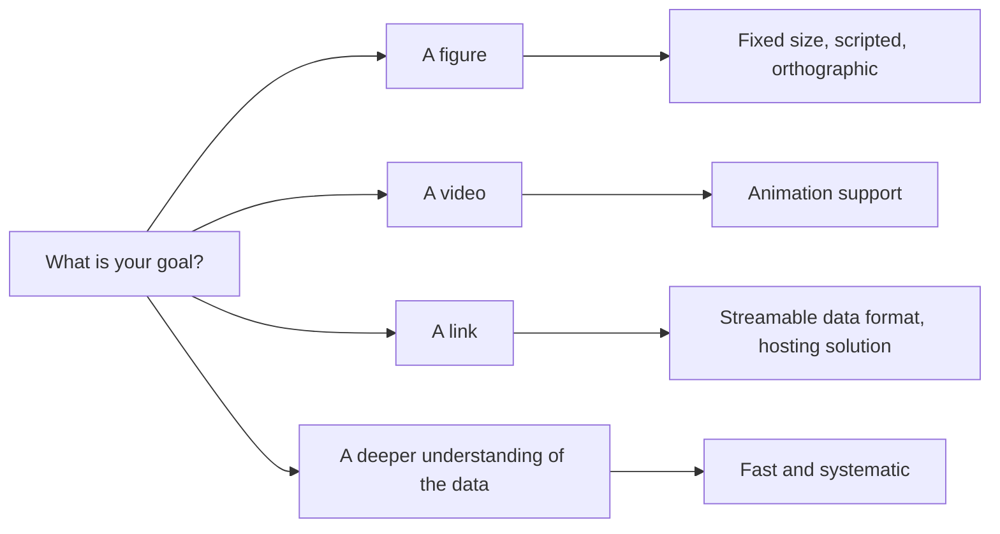
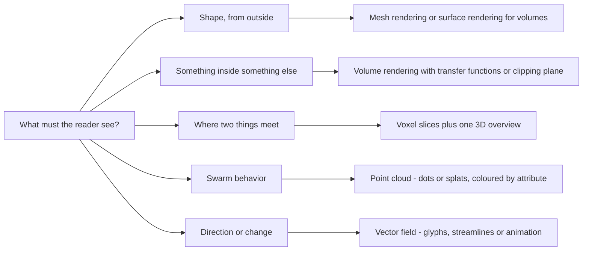



## What do you see?




ChatGPT: a tree
Claude: a mushroom, or an umbrella
Gemini: a mushroom cloud, an explosion



Thomas: a flower
Inga: a flower
Artür: a flower
Maria: a flower
Martin: flowers
Dante: a flower



**3D is our natural habitat.** Reading shape, depth and occlusion from a moving
view is something we all do continuously and without effort. 
Let's take advantage of this by rendering volumetric scientific datasets in 3D, so we can read them best.


---

## Motivation
### Purpose of visualization


3D datasets (datasets with a width, height, and depth dimension) can be visualized for different reasons: 


- **To understand** - comprehend a dataset in all spatial dimensions at once.
- **To learn** - visualize specific features to draw conclusions from.
- **To share and tell** - discuss your work (and your data) with and beyond scientific circles.

---

## Motivation
### From 2D to 3D: Adding depth


It can be much simpler and very helpful to explore 3D datasets in a dimensionality reduced way, for example by inspecting slices or maximum projections. But we would deprive ourselves of the depth dimension, which we are very trained to read well. 



#### How do we achieve depth? 







- **Occlusion**
- **Shading and shadows**
- **Perspective**
- **Motion parallax**
- **Stereo / VR**






---

## 3D Datasets - Data Types


Let's start by discussing the most common data types which can be represented in 3D.


### Voxels


A value at every point of a regular grid, so the position of a voxel is its
index and the file is just an array plus the size of one voxel.

That size is the thing to check: **isotropic** means the same spacing along all
three axes, **anisotropic** means it is not - the normal case in microscopy,
and it lives in the metadata rather than in the pixels.





- **Grid-based data structure**: Voxels are values at every position in a discrete block
- This enables us to look inside any structure in the grid
- Watch for **resolution**, and whether it is **isotropic** or **anisotropic**

- **Formats** TIFF / OME-TIFF, OME-Zarr, HDF5 / N5, NIfTI, NRRD, DICOM, MRC






---

## 3D Datasets - Data Types

### Meshes


Two words worth knowing: **watertight**, meaning the surface closes so a volume
can be computed, and **manifold**, meaning every edge belongs to exactly two
triangles. Software will open a mesh that is neither and then fail at the step
that matters.





- Points in space joined into triangles, describing a **surface**
- Quality metrics:
  - **watertight**: the surface closes so a volume can be computed
  - **manifold**, meaning every edge belongs to exactly two triangles
  - **normals** facing outward
  
- **Formats** STL, PLY, OBJ, glTF / GLB, VTK / VTP






---

## 3D Datasets - Data Types

### Point Clouds




- Carries **positions plus attributes**; no connectivity
- **Drawn as primitives** - dots, quads, or splats
- The **density** of the points will determine how well one can estimate a surface- 

- **Formats** LAS / LAZ, COPC, E57, PLY, plain XYZ / CSV






---

## 3D Datasets - Data Types

### Vector Fields




- Carries a **direction and a magnitude** per location
- Can be stored like voxels as a multi-channel volume
- The magnitude can for example represent flow, displacement, or diffusion
- **Glyphs** show directions for individual points; **streamlines** show where the field leads

- **Formats** VTK / VTI / VTU, NetCDF, multi-component NIfTI, OME-Zarr or HDF5
  with a component axis






---

## 3D Dataset - Sources in Science
### Microscopy


In microscopy, 3D datasets are assembled one Z slice at a time. A **stack of slices** is the volume.

Slices can either be taken with light through the full sample, or the sample has to be cut off slice by slice. 
This often leads to worse resolution in Z.
Datasets in microscopy often also contain multiple channels and can size up to terabytes per image.


- **Examples**: confocal, light-sheet, electron microscopy, histology



---

## 3D Dataset - Sources in Science
### Tomography


In tomography, the object is recorded from different angles. 
Each angle leads to a projection, and the volume is reconstructed from all projections together.
Tomography datasets are usually isotropic (same resolution in all dimensions), and usually also very large.


- **Examples**: clinical CT, micro-CT, synchrotron tomography, electron tomography, MRI



---

## 3D Dataset - Sources in Science
### Photogrammetry


In photogrammetry, the object is recorded with ordinary photographs taken from
many positions. Software then works out where each photograph was taken from,
and triangulates every surface point from the images that can see it.

A point only exists if several photographs see it, so overlap is what decides
whether the reconstruction works. It also only ever sees surfaces - there is no
interior - and it needs texture to match, so shiny, transparent or plain
objects fail. In exchange it is the cheapest 3D capture there is, and the only
one here whose colour is measured rather than chosen.


- **Examples**: drone survey, handheld and phone capture, multi-camera rigs



---

## 3D Dataset - Sources in Science
### Range scanning


In range scanning, a pulse is sent in a known direction and the time it takes
to come back gives a distance. The scanner sweeps through a grid of directions,
so what it records is one distance per direction - a range image, not a
picture.

Because distance is measured, the result arrives in real units. Only the first return is kept, so it sees
surfaces, and everything behind them is a shadow with no points in it. There is no colour
unless a camera is mounted alongside.


- **Examples**: terrestrial laser scanning, airborne LiDAR, structured light, time-of-flight cameras



---

## 3D Dataset - Sources in Science
### Echo and wave methods


Echo methods send a pulse and time the return, exactly like a laser scanner.
The difference is that the whole returning waveform is kept and reflections contribute to the reconstructed volume.
This makes it possible to retrieve information from areas in the shadow of the pulse.

Reconstruction is called migration here, but it is tomographic
back projection under another name, and it fails the same way when there are
too few shots.


- **Examples**: seismic reflection, sub-bottom profiling, sonar, ground-penetrating radar, ultrasound



---

## 3D Dataset - Sources in Science
### Simulation


In simulations, models are used to describe volumetric shapes, signals or processes.
The model can be used to sample values in space and time, and in different resolutions within the same dataset. 

Two consequences when you come to visualize it. Adaptive and unstructured grids
will not open in a viewer that expects a plain array. 


- **Examples**: CFD, molecular dynamics, finite elements, climate models



---

## Rendering Pipeline
### How do we get from 3D data to a picture on a screen?


1. **Application** - you assemble the scene: geometry, camera, lights, materials
2. **Geometry** - place every vertex in the world, project it onto the image plane
3. **Rasterization** - which pixels does each primitive cover?
4. **Pixel processing** - what colour is each of those pixels: lighting, texture, depth, blending




```mermaid
---
config:
  flowchart:
    wrappingWidth: 255
---
flowchart LR
  M@{ img: "", label: "Mesh", pos: "b", w: 68, h: 68 }
  P@{ img: "", label: "Point cloud", pos: "b", w: 68, h: 68 }
  F@{ img: "", label: "Vector field", pos: "b", w: 68, h: 68 }
  G@{ img: "", label: "Glyphs, streamlines", pos: "b", w: 68, h: 68 }
  T@{ img: "", label: "Primitives", pos: "b", w: 68, h: 68 }
  R@{ img: "", label: "Rasterize", pos: "b", w: 68, h: 68 }
  S@{ img: "", label: "Shade", pos: "b", w: 68, h: 68 }
  V@{ img: "", label: "Voxels", pos: "b", w: 68, h: 68 }
  RM@{ img: "", label: "March a ray", pos: "b", w: 68, h: 68 }
  PX@{ img: "", label: "Pixels", pos: "b", w: 68, h: 68 }
  M --> T
  P --> T
  F --> G
  G --> T
  T --> R
  R --> S
  S --> PX
  V --> RM
  RM --> PX
  V -. "isosurface" .-> T
```




- [The graphics pipeline, on learnopengl.com](https://learnopengl.com/Getting-started/Hello-Triangle)
- Akenine-Möller, Haines & Hoffman, *Real-Time Rendering* - chapter 2, the four-stage model used above


---

## How to pick a visualization approach
### Questions to ask


How to pick the right approach and the best tools for 3D Visualization? Here are a few questions that can guide you through this decision: 


1. **Explorative or reproducible** - clicking, or scripting
2. **How accessible** - what does your reader have to download and install
3. **Fast or pretty** - realtime vs. fancy, expensive rendering


People start at the beginning: here is my data, what can I do with it. That
leads to wandering, because there are always more things you can do than things
you need.

Start at the end instead. Name the picture you need, then ask what has to be
true for that picture to exist, and keep stepping backwards until you arrive at
the data you already have.




```mermaid
---
config:
  flowchart:
    wrappingWidth: 280
---
flowchart RL
  A@{ img: "", label: "The artifact", pos: "b", w: 80, h: 80 }
  B@{ img: "", label: "What should be shown", pos: "b", w: 80, h: 80 }
  E@{ img: "", label: "Fits in memory?", pos: "b", w: 80, h: 80 }
  F@{ img: "", label: "Which tool", pos: "b", w: 80, h: 80 }
  G@{ img: "", label: "The data you have", pos: "b", w: 80, h: 80 }
  A --> B
  B --> E
  E --> F
  F --> G
```



---

## How to pick a visualization approach

### Step 1 - what exactly is the artifact?


Be concrete and physical. Not "a visualisation" - a 180 mm wide figure at 300
dpi. A 20 second clip of multiple channels blending into each other. A URL a collaborator can open.

Then say what the reader has to be able to see: "that the vessel passes *through* the
tumour", "that these two cells are *separate*", "that the flow *reverses* here".






---

## How to pick a visualization approach
### Step 2 - what has to be visible, and what carries it?





---

## How to pick a visualization approach
### Step 3 - does it fit in memory?




- **Fits comfortably** - load it and work
- **Fits, but barely** - downsample to explore, run the real thing headless
- **Does not fit** - change the data layout:
    - **Chunking / tiling**: splitting the dataset up into sections (TIFF, ZARR, HDF5, load via Dask)
    - **Resolution pyramids**: storing multiple resolutions of different sizes (OME-ZARR)
    - **Load data on demand** (Neuroglancer, BigDataViewer, BigVolumeViewer, ...)






---

## How to pick a visualization approach
### Step 4 - choosing a tool - desktop


Here are some of the tools we have used, and what each one is good at.
This is a subjective, incomplete list that will become stale fast with upcoming updates and new releases.
Please let us know if we should be aware of a great tool that is not on this list.
 
**We focus on Open Source software only** not because there aren't great commercial options available. 
But they are often targeting specific domains or proprietary devices and formats and are not accessible to everyone.
Since we support scientists across all domains, we focus on software that can be used, inspected and adapted openly.




---

## How to pick a visualization approach
### Step 4 - choosing a tool - libraries


Many desktops program on the previous slide can also be scripted - napari,
ParaView and 3D Slicer from Python, Fiji from Groovy or Jython, MeshLab
through PyMeshLab, CloudCompare from the command line. 
But using a library can make it easier to include rendering into existing scripts and workflows. 




---

## How to pick a visualization approach
### Step 4 - choosing a tool - browser-based software


Browser based 3D visualization is rapidly growing. Here are a few options.
<!-- TODO point at the browser rendering page here once content/browser-rendering.md is committed -->




---

## How to proceed










